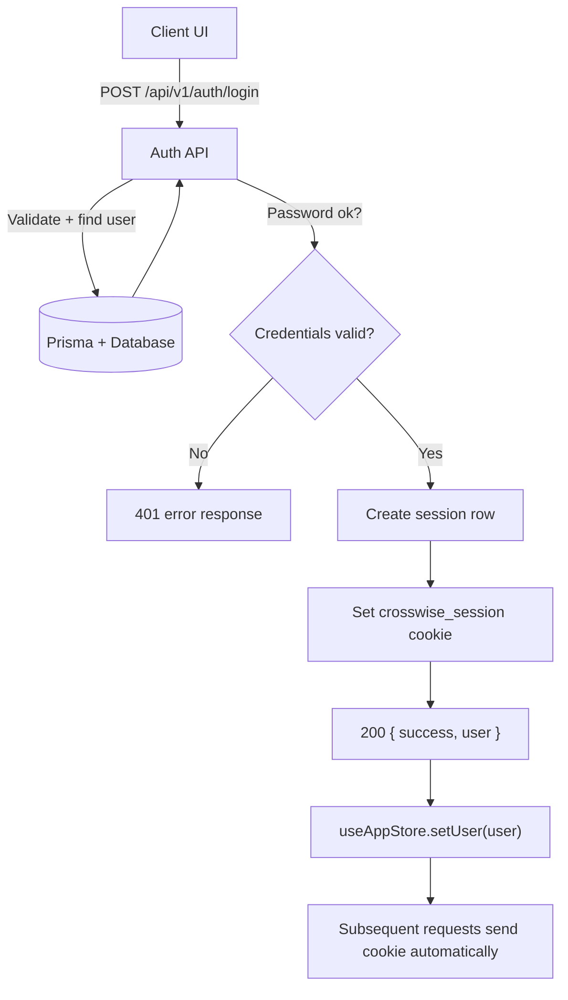

# Auth & Session Hydration Flow

## Purpose
Explain how users authenticate, how sessions are created, and how the client hydrates user state.

## Entry Points
- `POST /api/v1/auth/login`
- `POST /api/v1/auth/register`
- `GET /api/v1/auth/session`
- `POST /api/v1/auth/logout`

## Primary Actors
- Client UI (Next.js)
- Auth API routes
- Prisma + database

## Step-by-Step
1. Client submits credentials to `POST /api/v1/auth/login`.
2. API validates with Zod, finds user, verifies bcrypt hash.
3. API creates a session row (`token`, `expiresAt`) and sets `crosswise_session` cookie.
4. Client receives `{ success, user }` and hydrates store with `setUser`.
5. Root server layout reads cookie, resolves session, and passes user to `AuthProvider`.
6. Client store hydrates itself on mount with authenticated user data.

## Data Artifacts
- Cookie: `crosswise_session`
- Session row: `sessions` table
- User row: `users` table

## Failure Modes
- Invalid credentials -> 401 with error message.
- Missing/expired session -> `{ user: null }` from `GET /api/v1/auth/session`.
- Logout -> session deleted and cookie cleared.

## Key Files
- `src/app/api/v1/auth/login/route.ts`
- `src/app/api/v1/auth/register/route.ts`
- `src/app/api/v1/auth/session/route.ts`
- `src/app/api/v1/auth/logout/route.ts`
- `src/app/layout.tsx`
