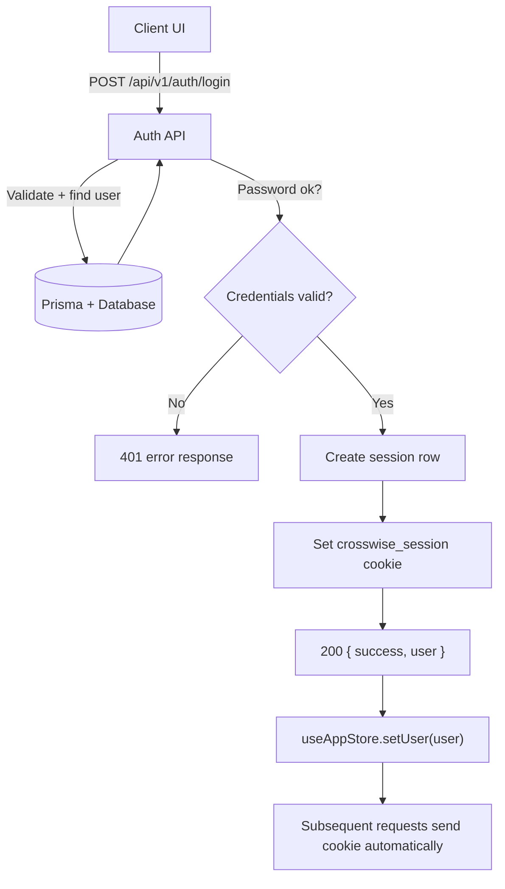
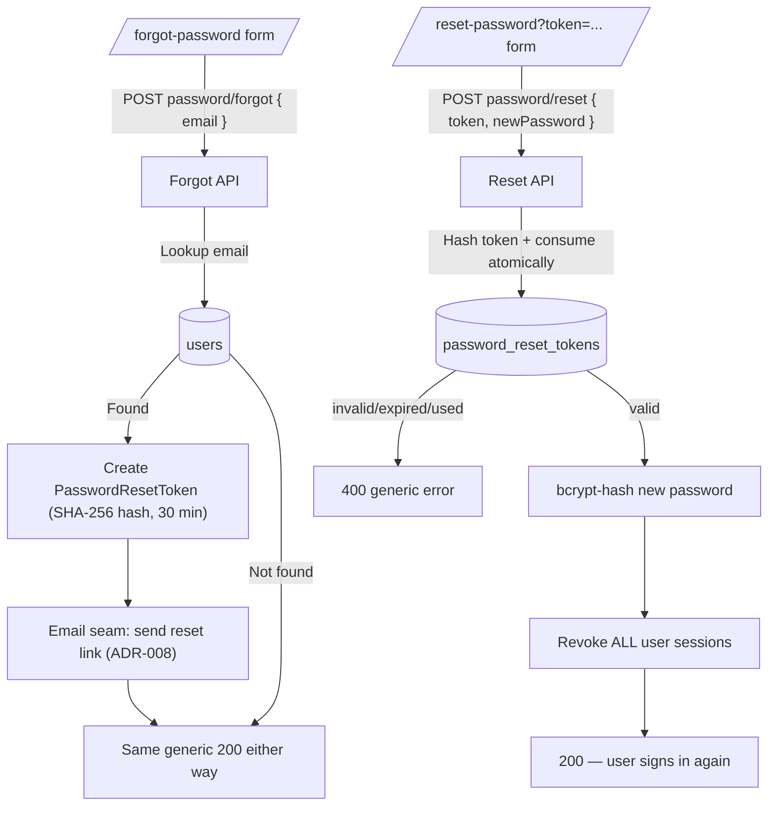

# Auth & Session Hydration Flow

## Purpose
Explain how users authenticate, how sessions are created, and how the client hydrates user state.

## Entry Points
- `POST /api/v1/auth/login`
- `POST /api/v1/auth/register`
- `GET /api/v1/auth/session`
- `POST /api/v1/auth/logout`
- `POST /api/v1/auth/password/forgot`
- `POST /api/v1/auth/password/reset`

## Primary Actors
- Client UI (Next.js)
- Auth API routes
- Prisma + database

## Step-by-Step
1. Client submits credentials to `POST /api/v1/auth/login`.
2. API validates with Zod, finds user, verifies bcrypt hash.
3. API creates a session row (`token`, `expiresAt`) and sets `crosswise_session` cookie.
4. Client receives `{ success, user }` and hydrates store with `setUser`.
5. Root server layout reads cookie, resolves session, and passes user to `AuthProvider`.
6. Client store hydrates itself on mount with authenticated user data.

## Forgot Password / Account Recovery (#7, ADR-008)

1. User follows "Forgot password?" from `/login` to `/forgot-password` and submits their email.
2. `POST /api/v1/auth/password/forgot` validates the email and **always** returns the same
   generic success — whether or not an account exists (no account enumeration via status,
   body, or errors).
3. If the email matches a user, the API creates a `PasswordResetToken` row: a
   `randomBytes(32)` token whose **SHA-256 hash** is stored (never the raw token),
   expiring after **30 minutes**. The raw token exists only in the reset link.
4. The reset link (`/reset-password?token=...`) is handed to the email delivery seam
   (`src/lib/email.ts`, ADR-008). Until a provider is configured: dev logs the link to the
   server console; production no-ops with a warning.
5. The user opens `/reset-password?token=...` and submits a new password
   (same policy as registration: 8–100 chars).
6. `POST /api/v1/auth/password/reset` hashes the incoming token, then consumes it
   atomically — it must exist, be unexpired, and never used. Any failure returns one
   generic "invalid or expired" error.
7. On success the new password is bcrypt-hashed (`hashPassword`, salt rounds 12) and
   **all of the user's sessions are revoked** (`deleteSessionsForUser`), so a stolen
   pre-reset session cannot persist. The user signs in again with the new password.

Token lifecycle: created (hash at rest, 30-min expiry) → consumed exactly once
(`consumedAt` set atomically) or expired → expired rows are cleaned up opportunistically
on the next token creation. Both endpoints carry an interim per-instance rate limit
(5 requests / 15 min per client) until real rate limiting lands (#89).

## Data Artifacts
- Cookie: `crosswise_session`
- Session row: `sessions` table
- User row: `users` table
- Password reset token row: `password_reset_tokens` table (`token_hash` unique,
  `expires_at`, `consumed_at`; cascade-deleted with the user)

## Failure Modes
- Invalid credentials -> 401 with error message.
- Missing/expired session -> `{ user: null }` from `GET /api/v1/auth/session`.
- Logout -> session deleted and cookie cleared.
- Forgot password with unknown email -> identical generic success (no enumeration).
- Reset with forged/expired/already-used token -> 400 with one generic message.
- Too many forgot/reset requests -> 429 (interim limiter; real rate limiting is #89).

## Key Files
- `src/app/api/v1/auth/login/route.ts`
- `src/app/api/v1/auth/register/route.ts`
- `src/app/api/v1/auth/session/route.ts`
- `src/app/api/v1/auth/logout/route.ts`
- `src/app/api/v1/auth/password/forgot/route.ts`
- `src/app/api/v1/auth/password/reset/route.ts`
- `src/lib/auth.ts` (reset-token helpers, session revocation)
- `src/lib/email.ts` (email delivery seam, ADR-008)
- `src/app/forgot-password/page.tsx`
- `src/app/reset-password/page.tsx`
- `src/app/layout.tsx`
