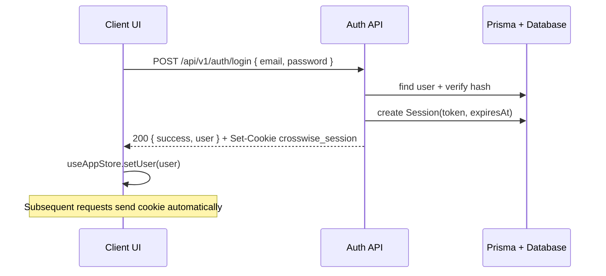
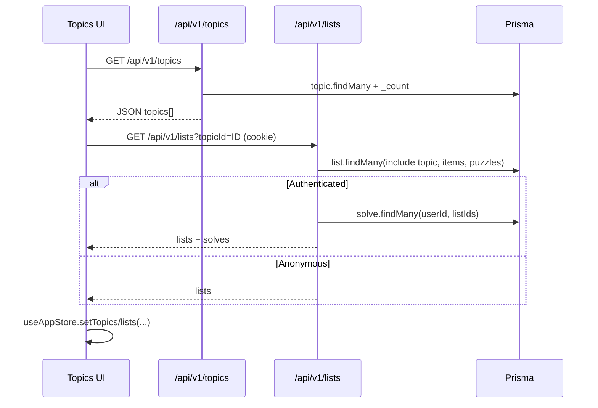
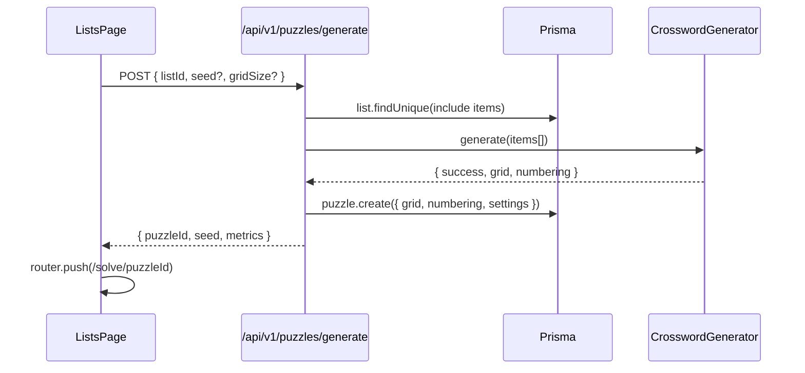
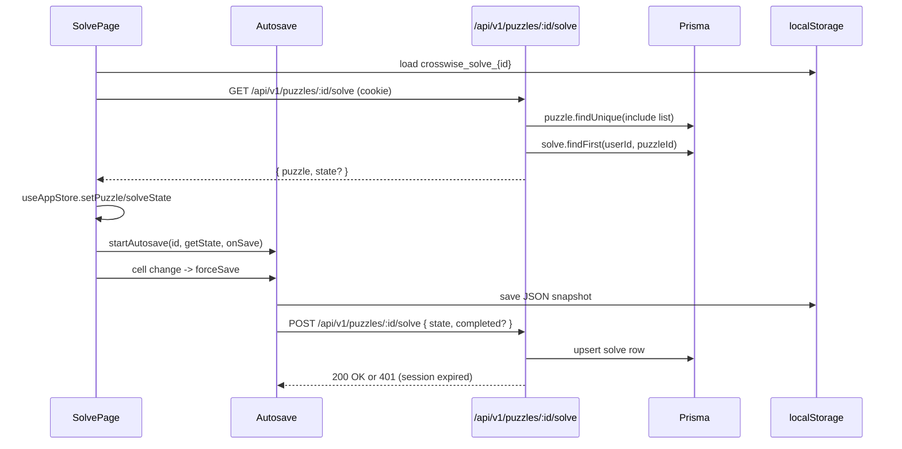

# Data Flow

## Authentication & Session Hydration
- Credentials are posted to `/api/v1/auth/login`. The handler validates with Zod, looks up the user, verifies the bcrypt hash, creates a session row, and returns a JSON payload while setting the `crosswise_session` cookie.
- Root server layout (`src/app/layout.tsx`) reads the cookie on every request. It resolves the session, passes the sanitized user into `AuthProvider`, and the client store hydrates itself on mount.

## Topic & List Retrieval
- Topics are fetched via `/api/v1/topics` (auth required). The API returns topics with list counts.
- When navigating to a topic, the client requests `/api/v1/topics/:id` for metadata and `/api/v1/lists?topicId=...` for lists. The list handler looks up the user through the cookie and joins recent solve history.

## List Import & Maintenance
- Import modal validates JSON client-side with `validateListJSON`. On success it posts to `/api/v1/lists` (new lists) or `/api/v1/lists/import` (auto-topic creation). The API normalises answers, creates list items inside a transaction, and returns the enriched list for UI refresh.
- Edits go through `PUT /api/v1/lists/:id`, which normalises answers, enforces uniqueness, updates/deletes/creates items via a transaction, and returns the updated list plus user solve summaries.

## Puzzle Generation Pipeline
- `POST /api/v1/puzzles/generate` accepts a list ID and optional seed/grid size. The handler fetches the list, picks up to 25 shuffled items, and feeds them to `CrosswordGenerator`.
- The generator preprocesses answers, evaluates placement candidates with heuristics (intersections, adjacency, connectivity), and keeps the best attempt across retries. On success, the handler persists the grid/numbering/settings JSON blobs and responds with the new puzzle ID.

## Solve State Lifecycle
- When the solver page mounts, it loads autosaved state from `localStorage` and requests `/api/v1/puzzles/:id/solve`. The API validates the session, returns puzzle data and any server-stored solve state.
- The page merges data, seeds the Zustand store, and registers autosave handlers. On every cell change (keypress/clear), the autosave manager writes to `localStorage` and invokes the server-sync callback. The callback posts a JSON-serialised solve state to the same endpoint; the server upserts a `Solve` row and stamps `completedAt` if the client reports completion.
- Manual checks (`letter`, `word`, `puzzle`) leverage the stored solution grid to annotate `checkResults` in the store, which powers clue status styling.

## Import / Export Flows
- **Export list:** Browser calls `GET /api/v1/lists/:id/export`; server emits PRP-compliant JSON with `Content-Disposition`. The UI creates a Blob and forces download.
- **Export solve state:** `PuzzleControls` uses `autosaveManager.exportSolveState` to serialise the local state and trigger a file download client-side without a network round-trip.
- **Import solve state (future-ready):** Autosave manager exposes `importSolveState` to hydrate from JSON backups if needed.
