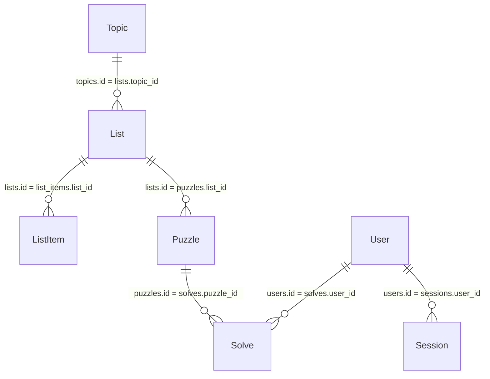

# Database: dev

Prisma models map to snake_case tables via `@@map` attributes. Local development uses SQLite (`file:./dev.db`); production can target PostgreSQL with the same schema.

## Tables

### `topics`
| Column | Type | Notes |
| --- | --- | --- |
| `id` | `String` (cuid) | Primary key |
| `name` | `String` | Unique topic name |
| `description` | `String?` | Optional details |
| `color` | `String` | Hex colour, default `#3B82F6` |
| `icon` | `String` | Emoji or short glyph |
| `created_at` | `DateTime` | Default `now()` |

Relationships: has many `lists`.

### `lists`
| Column | Type | Notes |
| --- | --- | --- |
| `id` | `String` (cuid) | Primary key |
| `topic_id` | `String` | FK → `topics.id` (cascade delete) |
| `name` | `String` | List title |
| `version` | `Int` | Defaults to 1 |
| `tags` | `String?` | JSON-encoded string array (unused in UI) |
| `source` | `ListSource` enum | Defaults to `UPLOAD` |
| `created_at` | `DateTime` | Default `now()` |
| `updated_at` | `DateTime` | Auto-updated |

Relationships: belongs to `Topic`; has many `ListItem` and `Puzzle`.

### `list_items`
| Column | Type | Notes |
| --- | --- | --- |
| `id` | `String` (cuid) | Primary key |
| `list_id` | `String` | FK → `lists.id` |
| `answer` | `String` | Uppercase, A–Z only |
| `clue` | `String` | Full clue text |
| `note` | `String?` | Optional hint/context |
| `difficulty` | `Difficulty?` | Defaults to `MEDIUM` |
| `created_at` | `DateTime` | Default `now()` |

### `puzzles`
| Column | Type | Notes |
| --- | --- | --- |
| `id` | `String` (cuid) | Primary key |
| `list_id` | `String` | FK → `lists.id` |
| `seed` | `String` | Generation seed |
| `grid` | `String` | JSON string of grid cells |
| `numbering` | `String` | JSON string of across/down metadata |
| `settings` | `String` | JSON string of generation settings |
| `created_at` | `DateTime` | Default `now()` |

### `solves`
| Column | Type | Notes |
| --- | --- | --- |
| `id` | `String` (cuid) | Primary key |
| `puzzle_id` | `String` | FK → `puzzles.id` |
| `user_id` | `String?` | FK → `users.id` (nullable for anonymous solves) |
| `state` | `String` | JSON stringified `SolveState` |
| `completed_at` | `DateTime?` | Timestamp when completed |
| `created_at` | `DateTime` | Default `now()` |
| `updated_at` | `DateTime` | Auto-updated |

Unique constraint: `(puzzle_id, user_id)` ensures one progressing solve per user/puzzle.

### `users`
| Column | Type | Notes |
| --- | --- | --- |
| `id` | `String` (cuid) | Primary key |
| `email` | `String` | Unique, lowercased |
| `name` | `String?` | Display name |
| `password_hash` | `String` | Bcrypt hash |
| `created_at` | `DateTime` | Default `now()` |
| `updated_at` | `DateTime` | Auto-updated |

### `sessions`
| Column | Type | Notes |
| --- | --- | --- |
| `id` | `String` (cuid) | Primary key |
| `user_id` | `String` | FK → `users.id` |
| `token` | `String` | Unique random 32-byte hex |
| `expires_at` | `DateTime` | Seven-day expiry by default |
| `created_at` | `DateTime` | Default `now()` |

## Enums
- `ListSource`: `UPLOAD`, `PASTE`, `API` (currently all lists default to `UPLOAD`).
- `Difficulty`: `EASY`, `MEDIUM`, `HARD` (UI maps numeric import values to these enums).

## Notable Behaviours
- All foreign keys cascade on delete; removing a topic deletes lists, puzzles, solves, and sessions associated through the chain.
- Crossword assets are stored as JSON strings; consumers should `JSON.parse` before use (`SolvePage` does this on load).
- Solver records are optional for anonymous users, enabling read-only puzzle access without authentication if desired.
