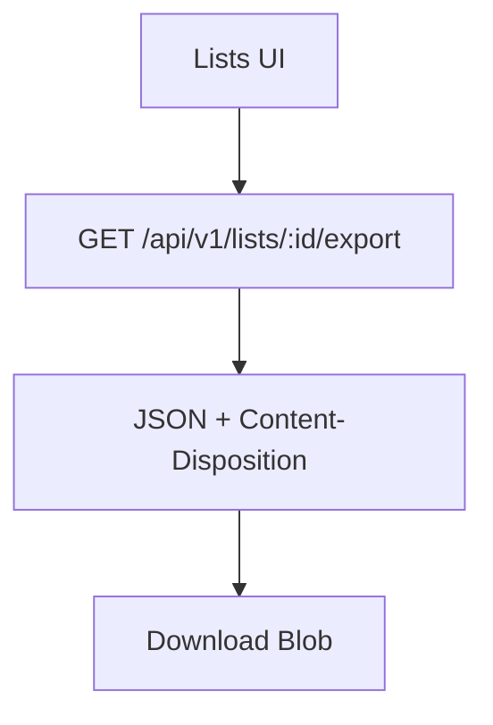
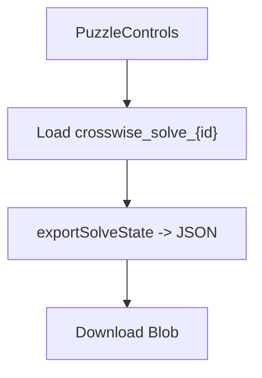
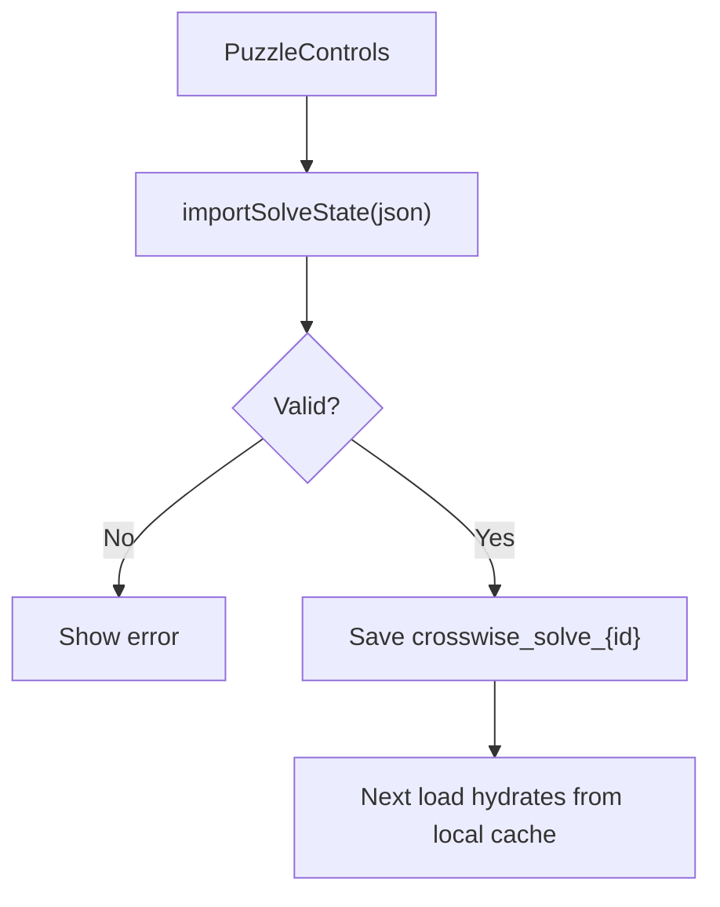

# Import / Export Flow

## Purpose
Summarize how lists and solve states are exported and imported.

## Entry Points
- `GET /api/v1/lists/:id/export`
- `autosaveManager.exportSolveState(puzzleId)`
- `autosaveManager.importSolveState(puzzleId, json)`

## Primary Actors
- Lists UI
- Puzzle controls UI
- Export API route
- Browser storage

## Step-by-Step (List Export)
1. Client requests `GET /api/v1/lists/:id/export`.
2. API returns PRP-compliant JSON with `Content-Disposition`.
3. Client downloads the Blob.

## Step-by-Step (Solve Export)
1. Client calls `exportSolveState` from `autosaveManager`.
2. Local JSON snapshot is generated.
3. Client downloads the JSON Blob.

## Step-by-Step (Solve Import)
1. Client selects a JSON file.
2. `importSolveState` validates basic shape.
3. State is saved to `localStorage`.
4. Next load hydrates solve state from local cache.

## Data Artifacts
- List export JSON (PRP)
- Solve export JSON (local format)
- `crosswise_solve_{puzzleId}` entry in `localStorage`

## Key Files
- `src/app/api/v1/lists/[id]/export/route.ts`
- `src/lib/autosave.ts`
- `src/components/PuzzleControls.tsx`
