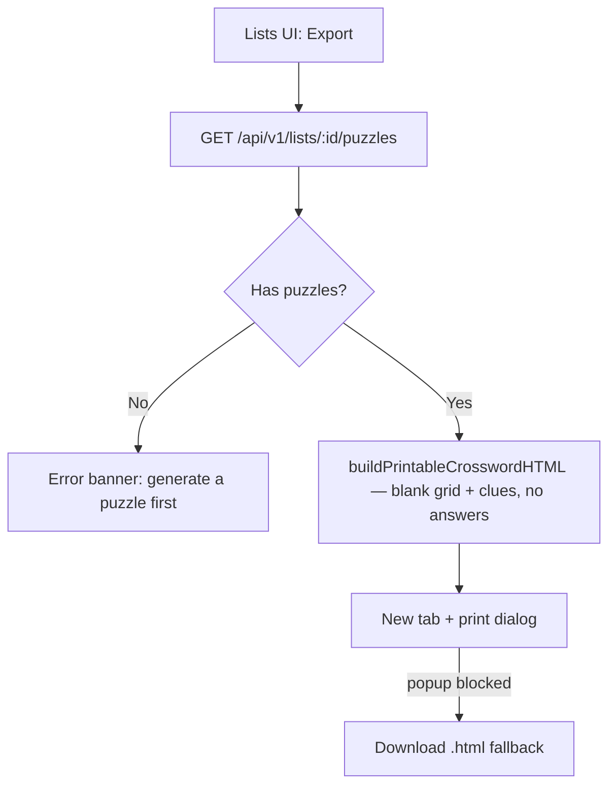
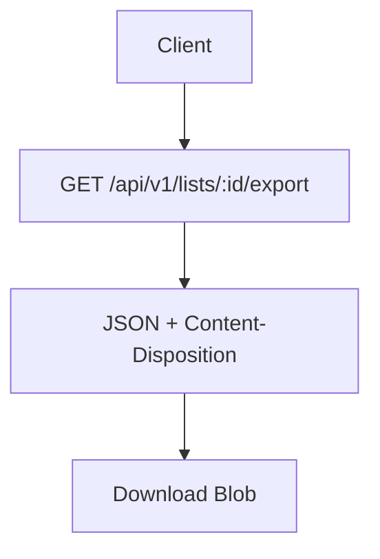
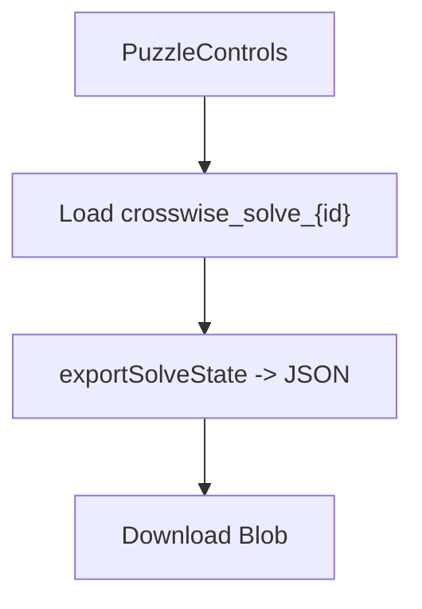
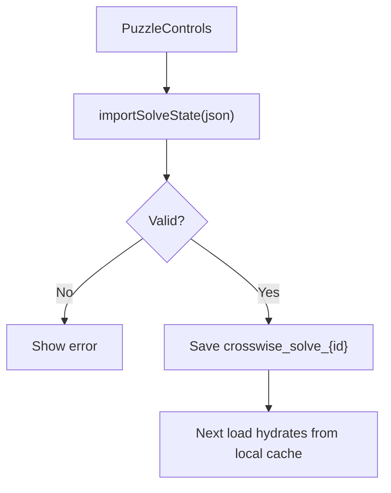

# Import / Export Flow

## Purpose
Summarize how lists and solve states are exported and imported.

## Entry Points
- Lists UI "Export" button → printable blank crossword (client-side, via `GET /api/v1/lists/:id/puzzles`)
- `GET /api/v1/lists/:id/export` (raw list JSON — data interchange, not wired to the Export button)
- `autosaveManager.exportSolveState(puzzleId)`
- `autosaveManager.importSolveState(puzzleId, json)`

## Primary Actors
- Lists UI
- Puzzle controls UI
- Export API route
- Browser storage

## Step-by-Step (Printable Puzzle Export — the "Export" button, #2)
1. User clicks "Export" on a list card.
2. Client fetches `GET /api/v1/lists/:id/puzzles` (auth + ownership scoped, newest first) and takes the **most recent** puzzle.
3. If the list has no generated puzzle, a friendly error banner is shown ("Generate a puzzle first — this list doesn't have one yet.") and nothing downloads.
4. `buildPrintableCrosswordHTML` (in `src/lib/export.ts`) renders a self-contained HTML document: heading with the list name, an empty numbered grid (block cells solid, letter cells blank with start-of-word numbers), and Across/Down clue lists. **No answer letters appear anywhere** — the builder follows the structure-only discipline of `exportPuzzleState`. All user text (list name, clues) is HTML-escaped.
5. `openPrintableCrossword` opens the document in a new tab and triggers the print dialog. If the popup is blocked, it falls back to downloading the HTML file.

## Step-by-Step (Raw List Export — data interchange)
`exportListAsJSON` / `exportListAsCSV` and the `GET /api/v1/lists/:id/export` route remain
for exchanging word lists in the import schema format (e.g. re-importing on another
account). They are no longer triggered by the list card's Export button.

1. Client requests `GET /api/v1/lists/:id/export`.
2. API returns PRP-compliant JSON with `Content-Disposition`.
3. Client downloads the Blob.

## Step-by-Step (Solve Export)
1. Client calls `exportSolveState` from `autosaveManager`.
2. Local JSON snapshot is generated.
3. Client downloads the JSON Blob.

## Step-by-Step (Solve Import)
1. Client selects a JSON file.
2. `importSolveState` validates basic shape.
3. State is saved to `localStorage`.
4. Next load hydrates solve state from local cache.

## Data Artifacts
- Printable blank crossword (self-contained HTML — grid structure + clues, no answers, no PII)
- List export JSON (PRP)
- Solve export JSON (local format)
- `crosswise_solve_{puzzleId}` entry in `localStorage`

## Key Files
- `src/lib/export.ts` (`buildPrintableCrosswordHTML`, `openPrintableCrossword`)
- `src/app/topics/[id]/lists/page.tsx` (`handleExportList`)
- `src/app/api/v1/lists/[id]/puzzles/route.ts`
- `src/app/api/v1/lists/[id]/export/route.ts`
- `src/lib/autosave.ts`
- `src/components/PuzzleControls.tsx`
