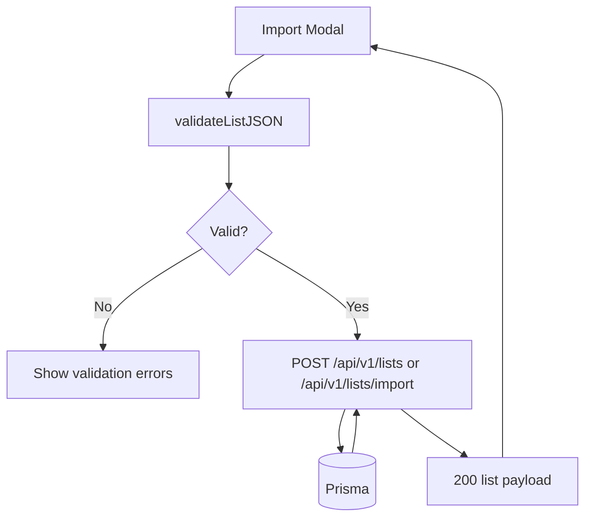
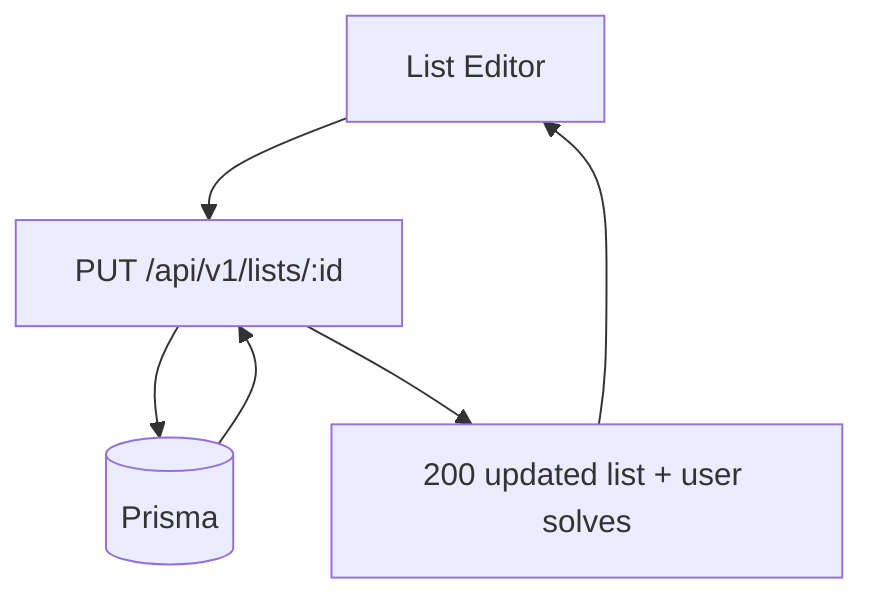

# List Import & Maintenance Flow

## Purpose
Detail how lists are imported, validated, and maintained (create/update).

## Entry Points
- `POST /api/v1/lists`
- `POST /api/v1/lists/import`
- `PUT /api/v1/lists/:id`
- `GET /api/v1/lists/:id/export`

## Primary Actors
- Import modal UI
- Lists API
- Prisma + database

## Step-by-Step (Import)
1. Client validates JSON with `validateListJSON`.
2. Client posts to `/api/v1/lists` or `/api/v1/lists/import`.
3. API validates answers against the allowed-character policy (#17): letters
   A–Z only after uppercasing. Any other character (accent, digit, hyphen,
   space) **denies the whole import** with a 400 whose details name the
   offending word — answers are never silently stripped. Uniqueness is
   enforced on the uppercased values.
4. API creates list + items inside a transaction (case normalization only).
5. API returns enriched list data for UI refresh.

## Step-by-Step (Edit)
1. Client submits edits via `PUT /api/v1/lists/:id`.
2. API normalizes answers and enforces uniqueness.
3. API updates, deletes, and creates items inside a transaction.
4. API returns updated list plus user solve summaries.

## List Delete (#16)
1. The delete control on a `ListCard` opens `DeleteListModal` (shared
   `ConfirmDeleteModal`): names the list, warns puzzles and solve progress are
   permanently removed. Cancel/Escape abort with no request.
2. Confirm calls `DELETE /api/v1/lists/:id` (auth required; lookup scoped to the
   owner via the list's topic - a non-owned id is a 404 and deletes nothing).
3. Items, puzzles, and solves are removed by `onDelete: Cascade` (guarded by
   `tests/schema-cascade.test.ts`); the route returns `{ listId, puzzleIds }`.
4. The client clears autosaved solve state for the returned `puzzleIds`, resets
   the current puzzle if it belonged to the deleted list, and drops the list
   from the store - no dangling puzzles or solve-history references remain.

## Data Artifacts
- `lists` table
- `list_items` table

## Failure Modes
- Invalid JSON format -> 400 with validation errors.
- Answer containing a character outside A–Z -> 400 naming the word; nothing is imported (#17).
- Duplicate answers after uppercasing -> 400.
- Missing session -> 401.

## Key Files
- `src/app/api/v1/lists/route.ts`
- `src/app/api/v1/lists/import/route.ts`
- `src/app/api/v1/lists/[id]/route.ts`
- `src/app/api/v1/lists/[id]/export/route.ts`
