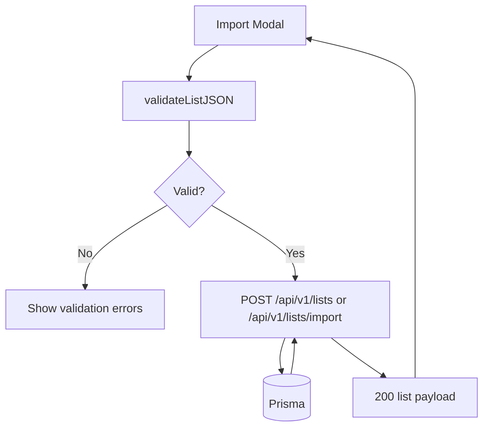
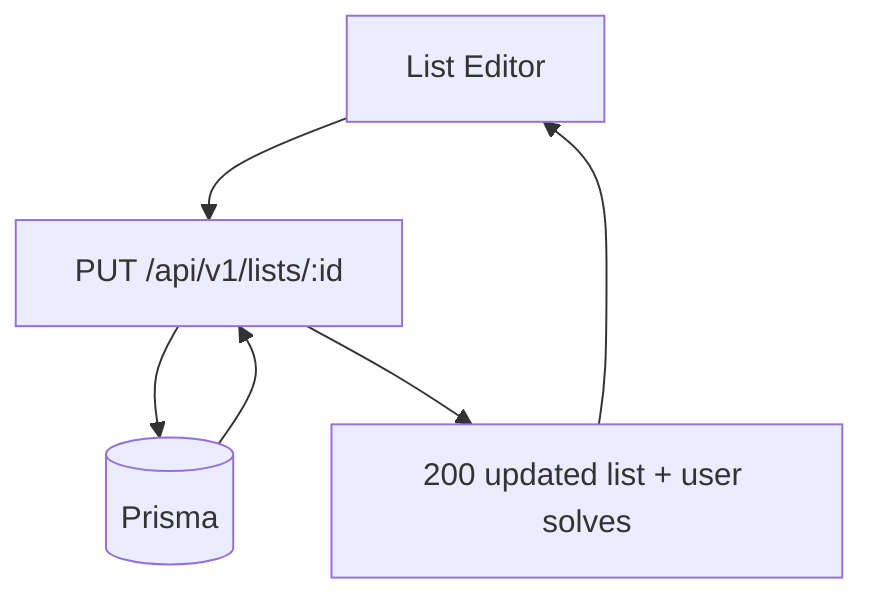

# List Import & Maintenance Flow

## Purpose
Detail how lists are imported, validated, and maintained (create/update).

## Entry Points
- `POST /api/v1/lists`
- `POST /api/v1/lists/import`
- `PUT /api/v1/lists/:id`
- `GET /api/v1/lists/:id/export`

## Primary Actors
- Import modal UI
- Lists API
- Prisma + database

## Step-by-Step (Import)
1. Client validates JSON with `validateListJSON`.
2. Client posts to `/api/v1/lists` or `/api/v1/lists/import`.
3. API normalizes answers and enforces uniqueness.
4. API creates list + items inside a transaction.
5. API returns enriched list data for UI refresh.

## Step-by-Step (Edit)
1. Client submits edits via `PUT /api/v1/lists/:id`.
2. API normalizes answers and enforces uniqueness.
3. API updates, deletes, and creates items inside a transaction.
4. API returns updated list plus user solve summaries.

## Data Artifacts
- `lists` table
- `list_items` table

## Failure Modes
- Invalid JSON format -> 400 with validation errors.
- Duplicate answers after normalization -> 400.
- Missing session -> 401.

## Key Files
- `src/app/api/v1/lists/route.ts`
- `src/app/api/v1/lists/import/route.ts`
- `src/app/api/v1/lists/[id]/route.ts`
- `src/app/api/v1/lists/[id]/export/route.ts`
