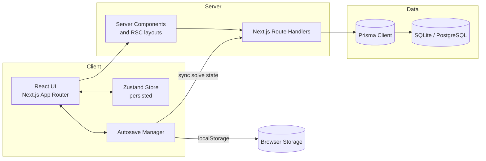

# CrossWise Overview

## Purpose
- Turn curated JSON word lists into playable crossword puzzles grouped by topic.
- Provide an end-to-end workflow: manage topics, import lists, generate puzzles, and solve them collaboratively or solo.
- Persist user progress both locally (offline resilience) and in the database for authenticated solvers.

## Architecture Summary
- **Client:** Next.js App Router pages with React 19 components. Global UI state lives in a persisted Zustand store for non-puzzle UI data, while puzzle progress is mirrored to `localStorage` per puzzle on each cell change through an autosave manager to protect against refreshes/offline usage.
- **Server:** Next.js route handlers act as the API surface. Handlers orchestrate validation with Zod, persistence through Prisma, and authentication based on signed session cookies.
- **Persistence:** Prisma targets SQLite (`file:./dev.db`) locally and can be re-pointed to PostgreSQL in production via `DATABASE_URL`. Crossword artefacts (grids, numbering, solve state) are stored as JSON strings.

## Technology Stack
| Layer | Details |
| --- | --- |
| Framework | Next.js 15 (App Router) with React 19 and TypeScript |
| Styling | Tailwind CSS with custom design tokens and shadcn-inspired primitives |
| State & UX | Zustand store (`src/lib/store.ts`), custom autosave manager, date-fns utilities |
| Validation | Zod schemas for API payloads and list import validation |
| Auth | Email/password with bcrypt hashing and cookie-backed sessions |
| Database | Prisma ORM with SQLite locally; compatible with PostgreSQL |
| Tooling | `tsx` for scripts, ESLint 9, Prettier 3, Tailwind, seedrandom for deterministic generation |

## Key Capabilities
- Topic and list management with JSON import/export workflows.
- Custom crossword generator with seeded backtracking algorithm and heuristic scoring.
- Rich solving interface (keyboard/touch navigation, check modes, completion modal).
- Autosave to browser and optional server synchronisation tied to authenticated users.
- Seeding scripts (`scripts/seed.ts`) for demo data and resets.
