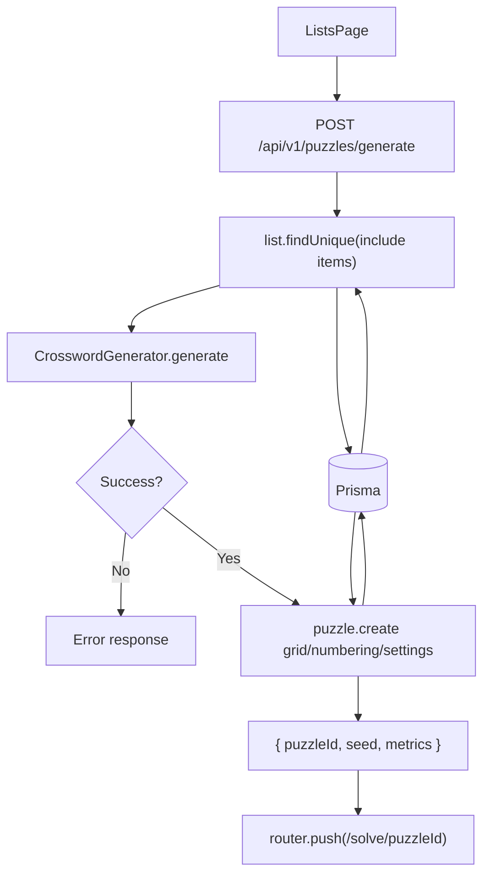

# Puzzle Generation Flow

## Purpose
Describe how the system generates a new crossword from a list.

## Entry Points
- `POST /api/v1/puzzles/generate`

## Primary Actors
- Lists UI
- Puzzles API
- Crossword generator
- Prisma + database

## Step-by-Step
1. Client posts `{ listId, seed?, gridSize? }` to `/api/v1/puzzles/generate`.
2. API fetches list + items from Prisma.
3. API resolves the seed (see Seed Contract below).
4. `CrosswordGenerator` selects up to 150 items via its seeded RNG, preprocesses
   answers, and searches for a placement — the same RNG drives selection and placement.
5. On success, API stores `grid`, `numbering`, `settings` JSON blobs and the resolved seed.
6. API returns `{ puzzleId, seed, metrics }`.
7. Client navigates to `/solve/:puzzleId`.

## Seed Contract (#35, ADR-006)
- Generation is fully deterministic: the same `(list content, seed, gridSize)` always
  produces the same grid and numbering. No `Math.random()` or `Date.now()` on the path.
- If the client supplies `seed`, it is used verbatim and stored on the puzzle.
- If the client omits `seed`, the API derives a stable default from the list id +
  item content (`deriveListSeed` in `src/lib/crossword-generator.ts`) — editing the
  list changes the default; re-requesting without edits reproduces the same puzzle.
- Clients that want a *different* puzzle for the same list pass a fresh explicit seed
  (the web UI does this on generate/regenerate). Variety is the client's choice;
  reproducibility is the server's guarantee.

## Data Artifacts
- `puzzles` table (`grid`, `numbering`, `settings` JSON strings)

## Failure Modes
- Missing session -> 401.
- List not found -> 404 / error payload.
- Generator failure -> 400/500 with message.

## Key Files
- `src/app/api/v1/puzzles/generate/route.ts`
- `src/lib/crossword-generator.ts`
