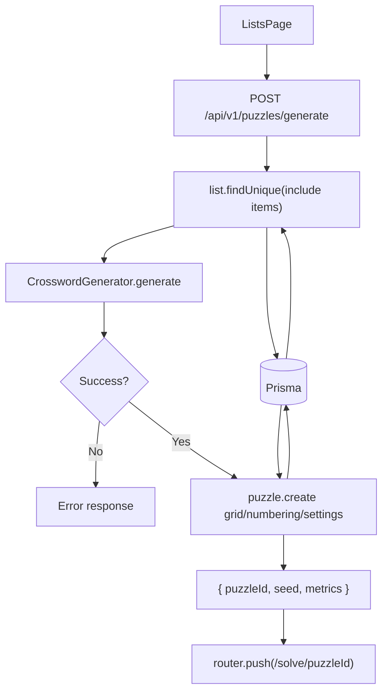

# Puzzle Generation Flow

## Purpose
Describe how the system generates a new crossword from a list.

## Entry Points
- `POST /api/v1/puzzles/generate`

## Primary Actors
- Lists UI
- Puzzles API
- Crossword generator
- Prisma + database

## Step-by-Step
1. Client posts `{ listId, seed?, gridSize? }` to `/api/v1/puzzles/generate`.
2. API fetches list + items from Prisma (`orderBy: id` — see Determinism below).
3. API resolves the seed (see Seed Contract below).
4. `CrosswordGenerator` canonicalizes item order, selects up to 150 items via its
   seeded RNG, preprocesses answers, and searches for a placement — the same RNG
   drives selection and placement.
5. **Grid-size ladder (#99)**: when the client does not pin a `gridSize`, the API
   tries 15×15, 17×17, then 19×19 and keeps the result that places the most words
   (stopping early once every word fits). An explicit `gridSize` is honoured exactly.
6. **Partial acceptance (#99)**: a puzzle is stored as long as at least 2 words
   placed. Words that did not fit are returned as `unplacedWords` and persisted in
   the puzzle `settings` so the solve UI can disclose them. Fewer than 2 placeable
   words -> 422 with the full unplaced list and a suggestion to split the list.
7. API stores `grid`, `numbering`, `settings` JSON blobs and the resolved seed.
8. API returns `{ puzzleId, grid, numbering, seed, placedWords, totalWords, unplacedWords }`.
9. Client navigates to `/solve/:puzzleId`; the solve page shows a dismissible
   notice when `unplacedWords` is non-empty.

## Seed Contract (#35, ADR-006)
- Generation is fully deterministic: the same `(list content, seed, gridSize)` always
  produces the same grid and numbering. No `Math.random()` or `Date.now()` on the path.
- If the client supplies `seed`, it is used verbatim and stored on the puzzle.
- If the client omits `seed`, the API derives a stable default from the list id +
  item content (`deriveListSeed` in `src/lib/crossword-generator.ts`) — editing the
  list changes the default; re-requesting without edits reproduces the same puzzle.
- Clients that want a *different* puzzle for the same list pass a fresh explicit seed
  (the web UI does this on generate/regenerate). Variety is the client's choice;
  reproducibility is the server's guarantee.

## Data Artifacts
- `puzzles` table (`grid`, `numbering`, `settings` JSON strings)

## Failure Modes
- Missing session -> 401.
- List not found (or not owned by the caller) -> 404.
- Fewer than 2 words can be placed together -> 422 with
  `details.unplacedWords` naming every word that did not fit (#99).
- Invalid request body -> 400; unexpected errors -> 500.

## Key Files
- `src/app/api/v1/puzzles/generate/route.ts`
- `src/lib/crossword-generator.ts`
