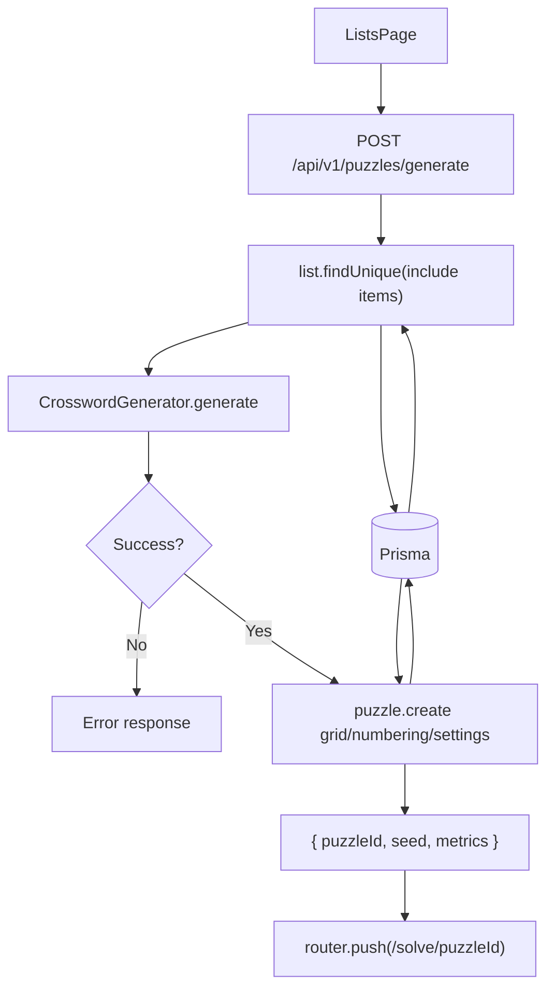

# Puzzle Generation Flow

## Purpose
Describe how the system generates a new crossword from a list.

## Entry Points
- `POST /api/v1/puzzles/generate`

## Primary Actors
- Lists UI
- Puzzles API
- Crossword generator
- Prisma + database

## Step-by-Step
1. Client posts `{ listId, seed?, gridSize? }` to `/api/v1/puzzles/generate`.
2. API fetches list + items from Prisma.
3. API shuffles items and limits to 150 entries.
4. `CrosswordGenerator` preprocesses answers and searches for a placement.
5. On success, API stores `grid`, `numbering`, and `settings` JSON blobs.
6. API returns `{ puzzleId, seed, metrics }`.
7. Client navigates to `/solve/:puzzleId`.

## Data Artifacts
- `puzzles` table (`grid`, `numbering`, `settings` JSON strings)

## Failure Modes
- Missing session -> 401.
- List not found -> 404 / error payload.
- Generator failure -> 400/500 with message.

## Key Files
- `src/app/api/v1/puzzles/generate/route.ts`
- `src/lib/generator/CrosswordGenerator.ts`
