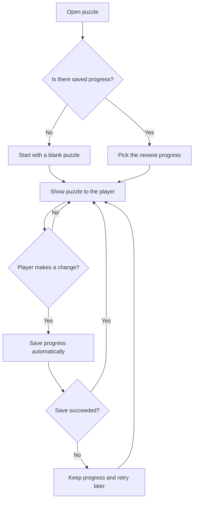
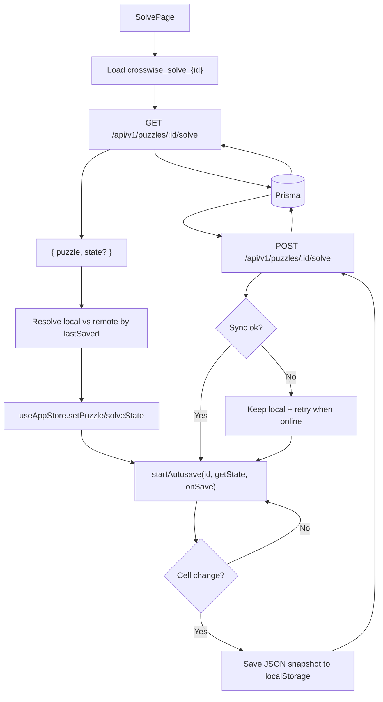

# Solve State Lifecycle Flow

## Purpose
Explain how solve state is loaded, merged, persisted locally, and synced to the server.

## Entry Points
- `GET /api/v1/puzzles/:id/solve`
- `POST /api/v1/puzzles/:id/solve`
- `localStorage` autosave

## Primary Actors
- Solve page UI
- Autosave manager
- Solve API
- Prisma + database
- Browser storage

## Step-by-Step
1. Solve page mounts and loads `crosswise_solve_{id}` from `localStorage`.
2. Client requests `GET /api/v1/puzzles/:id/solve`.
3. API returns puzzle metadata + existing solve state (if any).
4. Client normalizes and resolves local vs. remote state via timestamps.
5. Client seeds the Zustand store and starts autosave.
6. On each cell change, autosave writes to `localStorage` and posts to server.
7. Server upserts a `Solve` row and sets `completedAt` when solved.

## Conceptual Flow (Non-Technical)
1. Open a puzzle and check if any progress is already saved.
2. If saved progress exists, use the newest version.
3. Show the puzzle with that progress.
4. While solving, keep saving progress automatically.
5. If saving fails, keep the latest progress and try again later.

---
## Technical Flow

## Data Artifacts
- Local: `crosswise_solve_{puzzleId}` in `localStorage`
- Remote: `solves` table, `state` JSON string

## Failure Modes
- Missing session -> 401 on `GET`/`POST`.
- Offline -> local autosave succeeds, server sync retries later.
- Corrupted local data -> autosave clears and continues with remote/new state.

## Key Files
- `src/app/solve/[id]/page.tsx`
- `src/lib/autosave.ts`
- `src/app/solve/solveState.ts`
- `src/app/api/v1/puzzles/[id]/solve/route.ts`

## Highlight Visual Contract (#12)
- `selectedClue` renders as a soft band (`bg-clue-band` token) across every cell
  of the clue; `selectedCell` renders the stronger `bg-cell-accent` fill plus a
  primary ring, so band vs active cell is distinguishable by more than colour.
- Check-state fills (correct/incorrect) layer above band/accent; the
  focus-visible ring (`ring` token) renders above everything at >=3:1 non-text
  contrast. Tokens live in `tailwind.config.ts` — no hard-coded highlight
  colours in `CrosswordGrid`.
