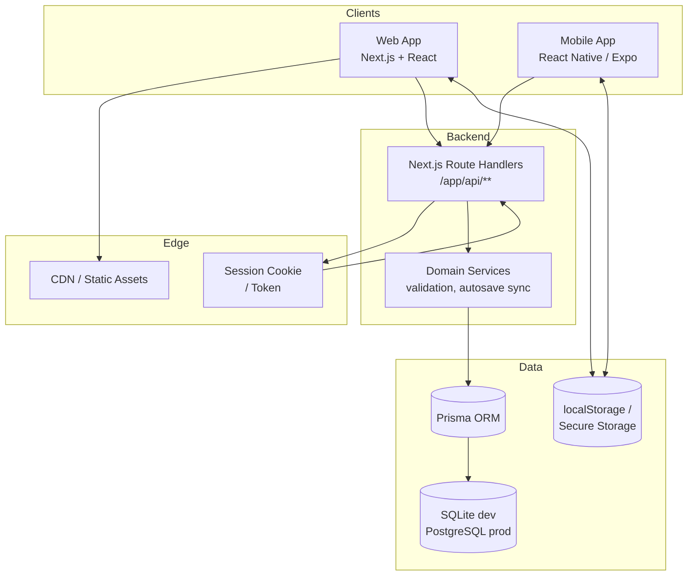

# System Architecture (Web + Mobile)

CrossWise serves both a web client (Next.js) and a mobile client (React Native / Expo) that share the same API surface and persistence model. Offline-friendly solve state lives on each device and syncs to the server when sessions are available.

## Interaction Notes
- Web uses cookie-backed sessions; mobile can reuse the same session cookie (for in-app webviews) or switch to a short-lived token issued by the same auth endpoints.
- Both clients cache puzzle data and autosave solve state locally, then sync via the `/api/v1/puzzles/:id/solve` endpoint when online.
- Background tasks are minimal; route handlers orchestrate validation, persistence, and autosave reconciliation in-process.

## Inexpensive Hosting Options
- **Vercel (Hobby, $0):** Great fit for Next.js; edge network + build pipeline included. Pair with external Postgres (e.g., Supabase/Railway).
- **Netlify (Free tier):** Works for static assets + serverless functions; less native App Router support but fine for API routes with adapters.
- **Render (Free Web Service + $0.03/hr Postgres):** Simple container deploy, persistent Postgres; good balance of price and control.
- **Railway (Free starter credits):** One-click Postgres + container deploys; set budget caps to avoid overages.
- **Fly.io (Pay-as-you-go, low idle cost):** Scales small containers near users; requires a bit more ops setup but competitive for light traffic.
