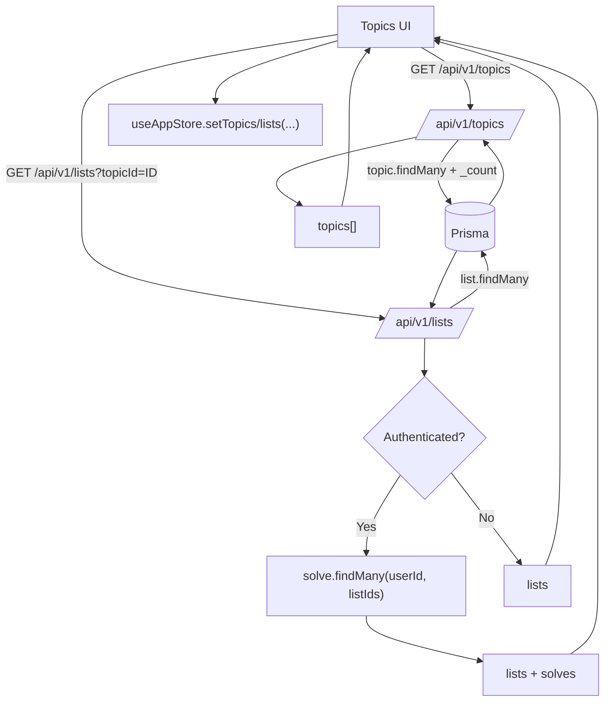

# Topic & List Retrieval Flow

## Purpose
Describe how topics and lists are fetched and how solve summaries are attached.

## Entry Points
- `GET /api/v1/topics`
- `GET /api/v1/topics/:id`
- `GET /api/v1/lists?topicId=...`

## Primary Actors
- Topics UI
- Lists UI
- Topics API
- Lists API
- Prisma + database

## Step-by-Step
1. Client requests `GET /api/v1/topics` (auth required).
2. API returns topics plus list counts.
3. Client navigates to a topic, requests topic metadata via `GET /api/v1/topics/:id`.
4. Client requests lists via `GET /api/v1/lists?topicId=...`.
5. Lists API joins list data with user solves (when authenticated).
6. Client updates store: `setTopics`, `setLists`, `selectTopic`, `selectList`.

## Topic Delete (#15)
1. The delete control on a `TopicCard` opens `DeleteTopicModal` (shared
   `ConfirmDeleteModal`), which names the topic and warns that all lists,
   puzzles, and solve progress under it are permanently removed. Cancel/Escape
   abort with no request.
2. Confirm calls `DELETE /api/v1/topics/:id` (auth required; lookup scoped to
   the owner - a non-owned id is a 404 and deletes nothing).
3. Children are removed by `onDelete: Cascade` (lists -> items/puzzles -> solves);
   the route deletes only the topic row and returns `{ topicId, listIds, puzzleIds }`.
4. The client clears autosaved solve state for the returned `puzzleIds`, resets
   the current puzzle if it belonged to a removed list, and drops the topic and
   its lists from the store - no refresh needed, no dangling references.

## Data Artifacts
- `topics` table
- `lists` table
- `list_items` table
- `solves` table (user history)

## Failure Modes
- Missing session -> 401.
- Topic not found (or owned by someone else) -> 404 / error payload.
- Delete failure -> error banner on the topics page; nothing removed locally.

## Key Files
- `src/app/api/v1/topics/route.ts`
- `src/app/api/v1/topics/[id]/route.ts`
- `src/app/api/v1/lists/route.ts`
